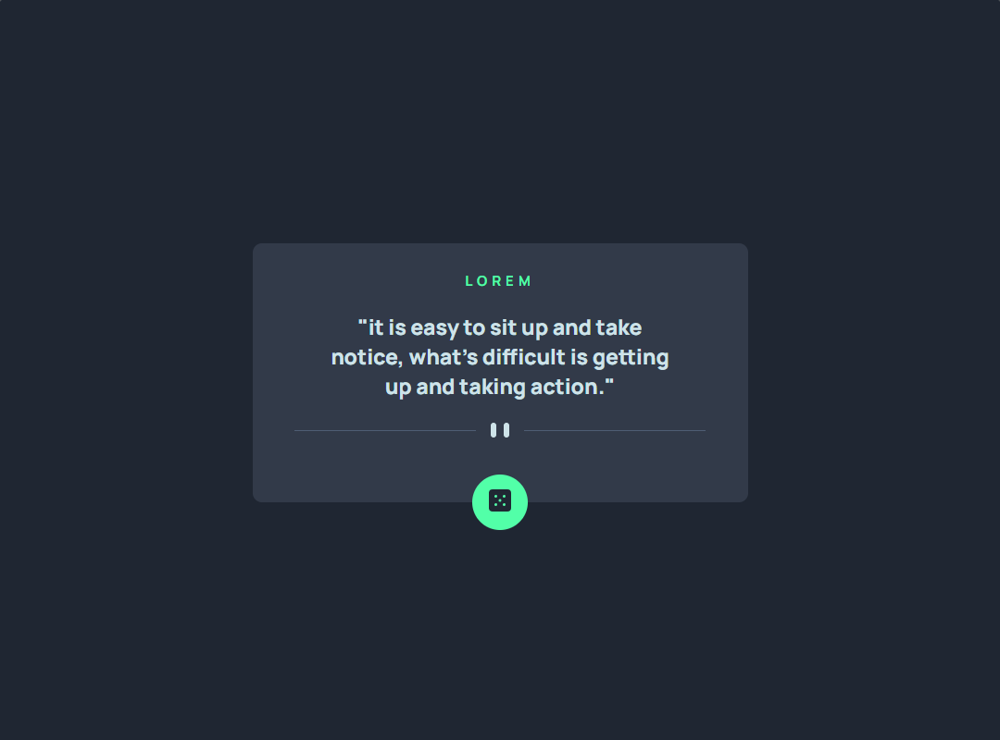

# Frontend-Mentor-Advice-generator-app

Esta é uma solução para o [desafio 'Advice generator app' no Frontend Mentor](https://www.frontendmentor.io/challenges/huddle-landing-page-with-a-single-introductory-section-B_2Wvxgi0). Os desafios do Frontend Mentor ajudam você a melhorar suas habilidades de codificação criando projetos realistas.

## Índice

- [Visão geral](#visão-geral)
   - [O desafio](#O-desafio)
   - [Captura de tela](#captura-de-tela)
   - [Links](#links)
- [Meu processo](#meu-processo)
   - [Construído com](#construído-com)
- [Autor](#autor)

## Visão geral

### O desafio

Os usuários devem ser capazes de:

- Ver o layout ideal para o aplicativo, dependendo do tamanho da tela do dispositivo
- Ver os estados de foco para todos os elementos interativos na página
- Gerar um novo conselho clicando no ícone do dado

### Capturas de tela

- Desktop - 

- Mobile  -

### Links

- URL da solução: [https://github.com/Jggranito/Frontend-Mentor-Advice-generator-app](https://github.com/Jggranito/Frontend-Mentor-Advice-generator-app)
- URL do site ao vivo: [https://jggranito.github.io/Frontend-Mentor-Advice-generator-app/](https://jggranito.github.io/Frontend-Mentor-Advice-generator-app/)

## Meu processo

### Construído com

- Marcação HTML5 semântica
- Propriedades personalizadas de CSS
- Flexbox
- JavaScript

## Autor

- Mentor de frontend - [@Jggranito](https://www.frontendmentor.io/profile/Jggranito)
- Twitter - [@Jggranito_](https://twitter.com/Jggranito_)